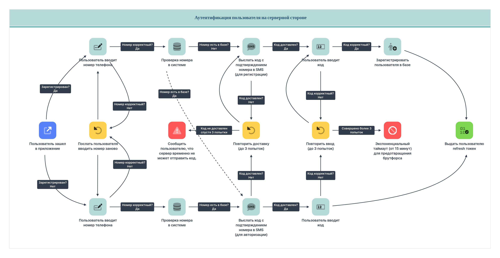
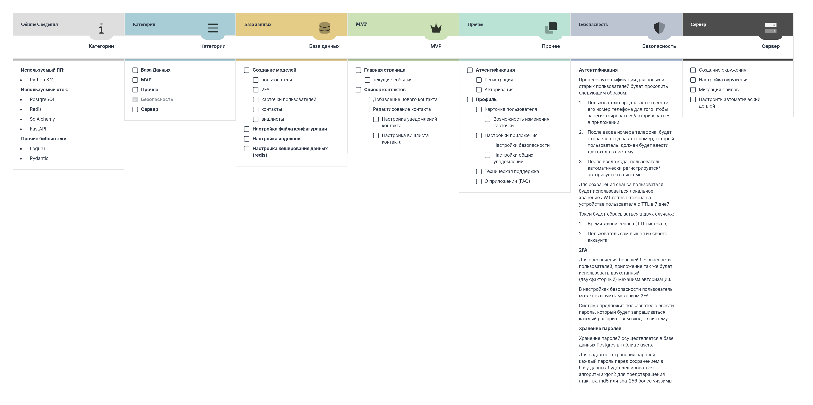

Основа для финансовой аналитики модели монетизации
идёт из предыдущей финансовой аналитики [практики №5](./../Неделя%205/).

Она включает в себя:
- Базовый финансовый прогноз (без чистой выручки и убытков):\
  [Финансовый прогноз (база)](./Финансовый%20прогноз.xlsx)\
  [Финансовый прогноз (база) - документ](./Финансовый%20прогноз.md)
- Модель монетизации: документ - В ПРОЦЕССЕ
- Модель монетизации: презентация - В ПРОЦЕССЕ
- Презентация по проекту вообще - [Презентация проекта](./Презентация%20тема%205.pdf)
- Ссылка на форму опроса - [Google форма](https://forms.gle/6sQZSZi2W3qKERqh9)

По поводу планирования, управления и контроля разработки:

1. мы используем Kanban + смешанную методологию:
    - для Kanban - мы используем Milanote: она поддерживает и систему тасков и визуальное продвинутое планирование
    и распределение; мы также используем сторонний скрипт [Patternunote](https://github.com/Falcion/Patternunote.git), который позволяет
    нам интегрировать history points и прочие элементы категорий к таскам в умной системе "весов";
    
    
2. мы используем для кросс-интеграции с репозиториями GitHub Projects, это
   методология управления и планирования смешанного вида: в ней есть и Agile, Kanban, Roadmap
   и ещё множество видов методологий с большим видом параметров - приоритет, итерация, history points и т.п.:\
   <https://github.com/orgs/Birthsync/projects/1/views/1>
