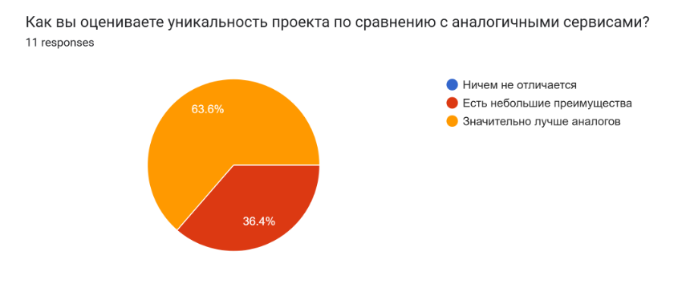
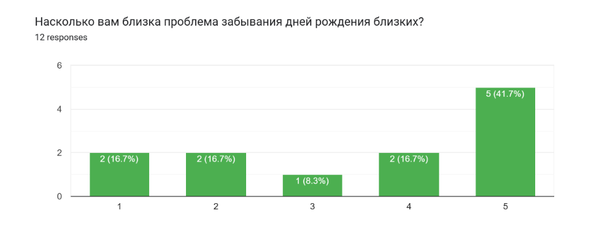
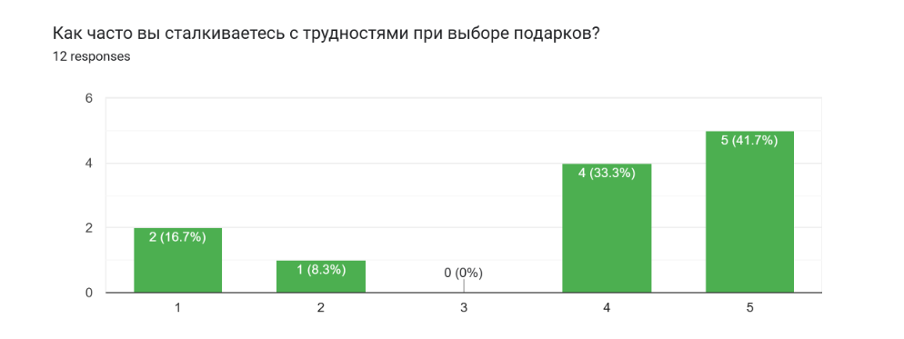

Неделя 12-14 уделялись разработке и улучшению программного обеспечения, а также сбору базовых данных и аналитик
по проекту вообще.

### Неделя 12

- [Аналитика по Telegram (MD)](./Аналитика%20по%20телеграму.md)
- [Аналитика по Telegram (PDF)](./Аналитика%20по%20телеграму.pdf)

### Неделя 13

По трекингу открытого кода, см.:

- [репозитория исходного кода бота](https://github.com/Birthsync/birthsync-telegram-bot)

Также была разработана специальная система по трекингу спама и прочих нежелательных элементов, например
рекламы казино и т.п.: за презентацией работы на практике.

### Неделя 14

Были собраны данные из предыдущей (см. [неделя 10-11](./../Неделя%2010-11/)) формы, 
вот некоторые визуализации:

- [[CSV]](./Опрос%20по%20общему%20качеству%20и%20политике%20монетизации%20проекта%20BIRTHSYNC%20(Responses)%20-%20Form%20Responses%201.csv)

Был также создан скрипт для аналитики и генерации отчёта по данному опросу: [survey/](./survey/)

**Ключевые выводы:**

1. **Уникальность проекта:** Большинство респондентов (6 из 11) видят "значительные преимущества" перед аналогами.

2. **Топ функций:**
   - Календарь с напоминаниями (8)
   - Анкеты друзей (7)
   - Подбор подарков через магазины (5)

3. **Монетизация:**
   - 45% готовы платить 50-100 руб./мес
   - Наиболее приемлемая модель: гибридная (реклама + премиум)

4. **Основные риски:**
   - Сложность интерфейса (5)
   - Конфиденциальность данных (4)

**Рекомендации:**

1. **UX/UI:**
   - Упростить навигацию
   - Добавить интерактивный гайд для новых пользователей

2. **Монетизация:**
   - Ввести пробный период премиум-доступа
   - Предложить пакетные предложения (годовая подписка со скидкой 20%)

3. **Безопасность:**
   - Реализовать прозрачную политику данных
   - Добавить двухфакторную аутентификацию

4. **Интеграции:**
   - Разработать API для синхронизации с популярными календарями
   - Создать Telegram-бота для мгновенных напоминаний

5. **Контент:**
   - Разработать образовательные материалы по выбору подарков
   - Ввести систему пользовательских рейтингов подарков