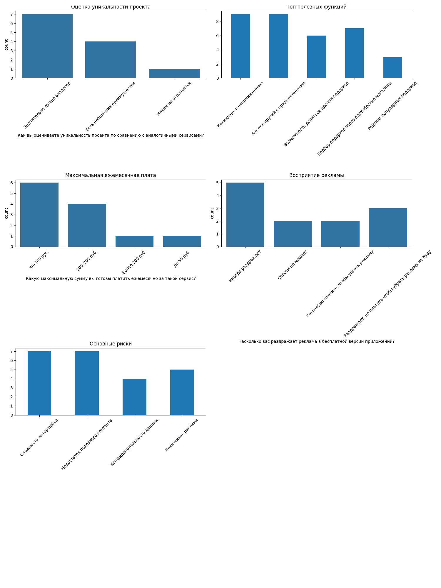

Скрипт обрабатывает данные и выводит их в графики, а также составляет отчёт.

**Аналитический отчет по результатам опроса:**

1. Уникальность проекта:
- Как вы оцениваете уникальность проекта по сравнению с аналогичными сервисами?
Значительно лучше аналогов     7
Есть небольшие преимущества    4
Ничем не отличается            1

2. Топ-3 востребованных функций:
Календарь с напоминаниями                     9
Анкеты друзей с предпочтениями                9
Подбор подарков через партнёрские магазины    7

3. Монетизация:
- Предпочтительные модели оплаты: Какая модель оплаты для вас предпочтительнее?
Годовая подписка (999 руб.)         4
Бесплатный доступ с рекламой        3
Покупка премиум-функций отдельно    3
Ежемесячная подписка (99 руб.)      2
- Средняя готовность платить: 50–100 руб.

4. Основные риски:
Counter({'Сложность интерфейса': 7, 'Недостаток полезного контента': 7, 'Навязчивая реклама': 5, 'Конфиденциальность данных': 4})

5. Рекомендации:
- Упростить интерфейс (упоминалось 1 раз)
- Улучшить систему подбора подарков (упоминалось 1 раз)
- Ввести гибкую систему подписок с пробным периодом
- Обеспечить прозрачность использования данных

Текстовые предложения:
- Частые запросы: [('nan', 9), ('возможно', 1), ('в', 1), ('будущем', 1), ('создать', 1)]
- Основные жалобы: [('nan', 9), ('никаких', 1), ('неудобств', 1), ('нет', 1), ('интеграция', 1)]