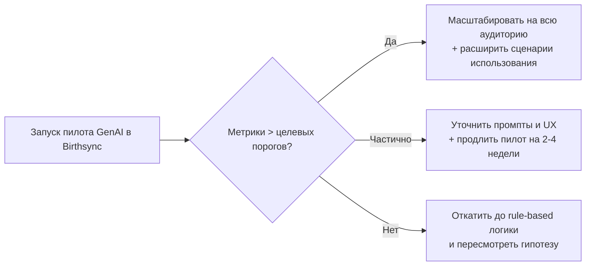

### (1). Название отчёта (тема)

Отчёт посвящён анализу технологических трендов, наиболее релевантных развитию стартапа Birthsync — сервиса напоминаний о днях рождения и подбора подарков, развиваемого как телеграм-бот и далее как самостоятельный цифровой продукт. Основная задача документа — связать глобальные и российские технологические тенденции с конкретными возможностями для продукта, сформулировать проверяемые инновационные гипотезы и задать системный подход к мониторингу новшеств, чтобы команда могла принимать обоснованные продуктовые и технические решения.

В рамках отчёта рассматриваются три ключевых тренда, значимых для BirthSync: 
- AI-персонализация и рекомендательные системы;
- генеративный ИИ для персонализированного контента;
- экосистемы мини-приложений/суперприложений на базе мессенджеров. 

Для одного из трендов формулируется детальная гипотеза внедрения, описываются ожидаемая ценность, риски, метрики и сценарии пилотирования. Отдельное внимание уделяется построению системы регулярного мониторинга технологий и рисков, а также формированию практического чек-листа действий.
### (2). Исходные данные и контекст стартапа BirthSync

#### (2.1). Краткое описание продукта и текущего состояния

Согласно исходной презентации Birthsync, продукт позиционируется как «умное приложение, которое поможет запоминать дни рождения друзей, хранить их предпочтения и подбирать идеальные подарки»[1]. В базовом сценарии пользователь:

* сохраняет даты дней рождения друзей и близких;
* заполняет или запрашивает у друга анкету с предпочтениями (цвет, хобби, нежелательные подарки и т.п.);
* ведёт список идей подарков и ссылки на магазины;
* получает напоминания о предстоящих событиях.

Из плана публикации MVP следует, что первая версия продукта реализуется как телеграм-бот с фокусом на напоминаниях, анкетах, виш-листах и учёте идей подарков[2]. Это важно: выбор Telegram как платформы по умолчанию сразу связывает проект с трендом mini-apps/ботов в мессенджерах. Отчёт о разработке лендинга показывает, что у проекта уже есть веб-страница на стеке Next.js и Tailwind и Vercel, с QR-кодом для быстрого перехода к боту и вниманием к фирменному стилю[3]. Это означает готовность команды к быстрым итерациям и экспериментам с онбордингом и маркетинговыми гипотезами.

Таким образом, на момент подготовки отчёта проекта — это:

* потребительский сервис B2C с эмоциональной «болью» (страх забыть важную дату и «провалить» подарок);
* цифровой продукт, сочетающий телеграм-бот и лендинг, с дальнейшей перспективой мобильного приложения;
* платформа, где данные о предпочтениях людей естественным образом накапливаются и могут быть использованы для персонализации.
#### (2.2). Стратегические гипотезы роста, вытекающие из концепции

Из презентации BirthSync можно выделить несколько базовых гипотез роста[1][2]:

1. **Частота использования.** 
   Подарки покупают не каждый день, но напоминания, идеи и виш-листы формируются заранее. Это означает, что продукт должен быть полезен не только «в день покупки», но и в «тихие» периоды — через генерацию идей, подбор вдохновения, совместное планирование подарков.
2. **Монетизация за счёт e-commerce.** 
   В презентации и планах маркетинга фигурируют партнёрства с магазинами и сервисами[1]. Это подводит к модели, где продукт зарабатывает на:

   * партнёрских программах и кэшбэках;
   * платных подписках с расширенными функциями (премиум-подбор подарков, расширенная аналитика, история подарков);

1. **Социальный эффект.** 
   Возможность делиться анкетами и идеями подарков создаёт «социальный граф» предпочтений. Чем больше друзей используют проект, тем выше ценность сервиса для каждого участника (сетевой эффект).

Эти гипотезы в совокупности делают для нашего проекта особенно важными технологии, которые:

* повышают релевантность предложений (что подарить, где купить, как поздравить);
* увеличивают частоту взаимодействия с продуктом между событиями;
* поддерживают масштабирование через платформы (мессенджеры, магазины, мини-приложения);
### (3). Обзор технологических трендов, релевантных нам

В данном разделе рассматриваются три технологических тренда, которые, с одной стороны, находятся на высоком или быстро растущем уровне зрелости, а с другой — имеют прямое прикладное значение для продукта нашего стартапа.
#### (3.1). Тренд (№1): AI-персонализация и рекомендательные системы в потребительских сервисах
##### (3.1.1). Суть тренда

AI-персонализация — это использование алгоритмов машинного обучения и анализа данных для формирования индивидуальных рекомендаций и уведомлений для каждого пользователя на основе его поведения, предпочтений и контекста в реальном времени. В отличие от классической сегментной персонализации (по полу, возрасту, городу), AI-подход учитывает десятки и сотни сигналов: историю действий, временные паттерны, похожесть на других пользователей, реакцию на предыдущие предложения и т.д. Для нашего продукта это напрямую конвертируется в способность:

* предлагать идеи подарков, учитывая не только статичные анкеты, но и реальные действия пользователя;
* подбирать оптимальное время и канал для напоминаний;
* строить рейтинг «наиболее вероятных» подарков для конкретного человека;

Формально можно сказать, что AI-персонализация стремится максимизировать условную вероятность удовлетворённости подарком (вероятность на данные, подарок, счастье), используя как можно более богатый вектор признаков $\mathbf{x}$ для пользователей и получателей подарков.
##### (3.1.2). Примеры применения и измеримый эффект

Мировой опыт показывает, что рекомендательные системы способны давать значимый вклад в выручку. Для примера, в аналитике по e-commerce регулярно отмечается, что персонализированные рекомендации дают до $30-35\%$ выручки у лидеров рынка вроде Amazon и Netflix. Отдельные отчёты рынка AI-рекомендаций показывают, что:

* рынок AI-based recommendation systems растёт с $2{,}01$ млрд долларов в 2023 году до $3{,}28$ млрд к 2028 году (CAGR около $10.4\%$);
* рынок AI-based personalization engines оценивается примерно в $455{,}4$ млрд долларов в 2024 году с прогнозом роста до $717.8$ млрд к 2033 году;

Такие объёмы объясняются тем, что даже относительно небольшой прирост конверсии (например, $+5-10\%$ к вероятности покупки при показе персонализированных рекомендаций) в крупных потребительских аудиториях даёт огромный эффект на выручку:

* коэффициента сохранения идей подарков на пользователя;
* доли пользователей, кликнувших по партнёрской ссылке;
* количества подарков, купленных «через» рекомендации сервиса;
* на $10-15\%$ уже может быть критичен, так как исходные базы аудиторий на ранних стадиях обычно небольшие, и каждый дополнительный процент конверсии сильно влияет на окупаемость маркетинга;
##### (3.1.3). Уровень зрелости и применимость к BirthSync

По уровню зрелости AI-персонализацию можно отнести к технологии на стадии широкого внедрения:

* в аналитике по e-commerce 2024–2025 годов AI-персонализация называется одним из ключевых драйверов роста;
* в российском контексте Habr и профильные блоги отдельно выделяют гиперперсонализацию как следующий шаг после базовых рекомендаций, подчёркивая, что «это уже не nice-to-have, а ожидаемый стандарт»;

Таким образом, для Бёрфсинк (Birthsync) это не рискованная радикальная инновация, а скорее обязательный элемент продукта уровня «best practice», который нужно внедрить по мере появления достаточного объёма данных. Основной риск здесь не в незрелости технологии, а в качестве данных (что подтверждается опросами: более половины HR-специалистов называют «грязные данные» главной проблемой внедрения ИИ-решений.
#### (3.2). Тренд №2: Генеративный ИИ для персонализированного контента и креатива
##### (3.2.1). Суть тренда

Генеративный ИИ (GenAI) — это класс моделей, способных **создавать** новые тексты, изображения, аудио и видео на основе обучающей выборки. На уровне пользователя это проявляется как сервисы, способные за секунды сгенерировать:

* поздравление с днём рождения в нужном тоне;
* идею подарка по описанию личности;
* визуальную открытку, мем или иллюстрацию;

Отчёты Gartner и других аналитических компаний помещают GenAI в верхнюю часть «Hype Cycle» и называют одной из ключевых трансформационных технологий десятилетия. В 2024–2025 годах фиксируется масштабный переход от экспериментов к промышленным внедрениям, в том числе в потребительских продуктах.

Для нашего продукта генеративный ИИ — это возможность автоматизировать два критически важных для пользователя аспекта:

1. **«Что подарить?»** — генерация идей подарков с учётом предпочтений, бюджета, доступности магазинов.
2. **«Как поздравить?»** — генерация текстов и визуалов поздравлений, которые кажутся «живыми» и персональными.
##### (3.2.2). Примеры применения и рыночная динамика

В аналитике по рынку генеративного ИИ для контент-создания подчёркивается устойчивый рост во всех регионах благодаря спросу на автоматизацию создания рекламного, e-commerce и медиа-контента. Одновременно исследования по потребительскому поведению показывают, что пользователи воспринимают GenAI скорее позитивно, особенно когда он помогает персонализировать опыт и повышать креативность.

Прямой сигнал зрелости тренда — рост трафика из генерирующих ИИ-источников на retail-сайты: по данным Adobe, в сезон распродаж трафик, приходящий на розничные сайты из ген-ИИ-сервисов, вырос более чем на 1300\% год к году. Это означает, что пользователи уже массово используют ИИ-инструменты как часть принятия решений о покупках, включая подарки.

Дополнительный индикатор — применение GenAI в смежных отраслях (например, в игровой индустрии: по данным исследования по Steam, в 2025 году уже около $20\%$ новых игр используют генеративный ИИ для ассетов, текста или маркетинга). Это показывает, что технология перестаёт быть нишевой и становится инфраструктурной.
##### (3.2.3). Уровень зрелости и применимость к продукту

С точки зрения зрелости, GenAI уже вышел из чистой экспериментальной фазы:

* предприятия кратно увеличивают траты на GenAI (рост расходов более чем в $6$ раз с 2023 по 2024 год;
* существуют зрелые облачные решения и API, которые можно интегрировать без собственной тяжёлой ML-команды;

Для продукта нашей разработки это означает, что:

* риск технологической невыполнимости низок (есть готовые сервисы);
* ключевые риски лежат в области качества промпт-дизайна, этики (неуместные поздравления) и экономики (стоимость токенов/запросов);

С точки зрения ценности именно для продукта Бёрфсинк (Birthsync), GenAI даёт возможность существенно увеличить частоту взаимодействия с сервисом: пользователь может заходить в бот не только ради напоминаний, но и ради генерации идей, поздравлений, оформления открыток.
#### (3.3). Тренд №3: Экосистемы мини-приложений и суперприложения на базе мессенджеров
##### (3.3.1). Суть тренда

Под суперприложениями понимаются платформы (WeChat, Grab, Gojek и др.), внутри которых пользователи выполняют множество задач: общение, платежи, транспорт, покупки, госуслуги. Внутри суперприложений развиваются mini-apps — лёгкие модульные приложения, запускаемые без установки отдельного клиента.

В 2025 году аналогичные экосистемы активно развиваются и в мессенджерах за пределами Китая, включая Telegram и конкурирующие платформы. Аналитические обзоры подчёркивают расширение mini-app-экосистем Telegram и WeChat, конкуренцию за разработчиков и новые модели монетизации.

Для нашего продукта это тренд не «про будущее», а про инфраструктуру прямо сейчас: MVP уже реализован как телеграм-бот, а лендинг ведёт пользователя в Telegram через QR-код. Фактически продукт изначально встроен в mini-app-экосистему.
##### (3.3.2). Примеры применения и значение для продукта

В статьях о китайских mini-program-экосистемах подчёркивается, что:

* mini-apps позволяют брендам присутствовать «на расстоянии одного клика» от чатов пользователей;
* снижены барьеры входа (не нужно ставить отдельное приложение);
* платёжная и социальная инфраструктура уже встроена в платформу;

Для продукта жизненный сценарий выглядит аналогично:

1. Пользователь видит пост/рекламу → сканирует QR-код с лендинга → попадает в мини-приложение/бот;
2. Далее он может сохранять дни рождения, делиться анкетами, переходить в магазины — не покидая комфортную среду мессенджера;

Это уменьшает friction (количество шагов до ценности) и повышает вероятность активации. Если сравнивать с отдельным приложением, mini-app-подход даёт предпосылку для более дешёвого привлечения пользователя (CAC) за счёт встроенных каналов дистрибуции и вирусных механик (шеринг анкет, совместные подарки).
##### (3.3.3). Уровень зрелости и применимость к продукту

Экосистемы суперприложений в Азии уже находятся на стадии зрелости, однако за пределами Азии (включая РФ и Европу) mini-apps находятся на этапе активного роста и поиска моделей монетизации.

Для продукта это означает:

* умеренный технологический риск (боты и mini-apps в Telegram хорошо задокументированы);
* высокий маркетинговый потенциал (мы можем «прорвать» барьер установки приложения, оставаясь в Telegram);
* возможность позже «мигрировать» часть функциональности в отдельное приложение без потери ядра пользователя;
#### (3.4). Сводное сравнение трендов

Ниже приведена таблица, суммирующая три тренда с точки зрения их зрелости и потенциала для продукта. Перед чтением таблицы важно понимать её назначение: она не претендует на академическую точность, а служит рабочим инструментом для приоритизации. Оценки по шкале потенциала «0-10» носят экспертный характер и основаны на совокупности рыночных данных и контекста продукта.

| Тренд                                      | Краткая суть                                      | Зрелость (качественная оценка)                   | Потенциал для проекта (0–10)    | Основной вектор ценности                           |
| ------------------------------------------ | ------------------------------------------------- | ------------------------------------------------ | ------------------------------- | -------------------------------------------------- |
| AI-персонализация и рекомендации           | ML-модели подстраивают контент под пользователя   | Высокая зрелость, массовое внедрение             | 9                               | Рост конверсии, удержания, монетизации             |
| Генеративный ИИ для контента               | Модели генерируют тексты/изображения/идеи         | Быстрый рост, переход от пилотов к продакшену    | 10                              | Увеличение частоты использования и вау-эффекта     |
| Mini-apps и суперприложения в мессенджерах | Сервисы работают внутри Telegram/других платформ  | Зрелость в Азии, активный рост в остальном мире  | 8                               | Упрощение онбординга и масштабирование дистрибуции |

Интерпретируя таблицу, можно сделать несколько выводов:

* **Генеративный ИИ:**
  получает максимальный балл (10), так как напрямую усиливает эмоциональную ценность проекта (поздравления, идеи подарков), а также уже демонстрирует массовое принятие пользователями и бизнесом;
* **AI-персонализация:**
  имеет почти столь же высокий потенциал (9), но её эффект во многом опирается на накопленные данные. На ранней стадии продукта это может означать меньшую скорость проявления результата;
* **Mini-apps:**
  важный инфраструктурный тренд, позволяющий проекту «ехать на волне» развития Telegram-экосистемы. Однако сам по себе он не создаёт уникального конкурентного преимущества, если не подкреплён качеством продукта и персонализацией.
### (4). Применение инновации: гипотеза использования генеративного ИИ в BirthSync

В качестве технологии для детальной проработки в рамках задания №2 выберем генеративный ИИ (тренд №2), поскольку он обладает максимальным потенциалом ценности для пользователей проекта и уже обладает достаточной зрелостью и доступностью API.
#### (4.1). Формулировка гипотезы

**Гипотеза H1 (основная):**

Если встроить в проект генерирующего AI-ассистента по подаркам и поздравлениям, который использует данные анкет и истории взаимодействий, то:

* доля пользователей, которые сохраняют хотя бы одну идею подарка в месяц, увеличится не менее чем на $+20\%$ относительно контрольной группы;
* доля пользователей, перешедших по хотя бы одной партнёрской ссылке за месяц, вырастет на $+10-15\%$;
* средняя месячная частота взаимодействий с ботом (сессий на пользователя) увеличится минимум на $+25\%$;

Обоснование чисел:

* Мировые кейсы показывают, что внедрение персонализированных рекомендаций и GenAI-инструментов ведёт к двузначному росту вовлечённости и выручки (10-30% и более), что отражено в маркетинговых отчётах и примерах e-commerce;
* Для раннего стартапа разумно взять консервативный нижний порог в $+10-20\%$ по ключевым метрикам, чтобы не завысить ожидания;

Формально, для одной из ключевых метрик можно записать:
$$
\Delta \text{CTR}*{\text{партнёрских ссылок}} = \text{CTR}*{\text{с GenAI}} - \text{CTR}_{\text{контроль}} \ge 0{,}10.
$$

Если в текущем состоянии:
$$\text{CTR}*{\text{контроль}} \approx 5\%$$то target-уровень: $\text{CTR}*{\text{с GenAI}} \ge 5,5\%-6\%$ выглядит реалистичным и измеримым.
#### (4.2). Ценность для пользователя и бизнеса

С точки зрения пользователя, GenAI-ассистент закрывает несколько болей:

1. **Страх ошибиться с подарком.** 
   Модель может предложить несколько вариантов подарков с пояснением, «почему это подойдёт этому человеку», что снижает когнитивную нагрузку и тревожность;
2. **Отсутствие вдохновения.** 
   Генерация нестандартных идей (например, «совместный опыт», впечатления, подписки) помогает уйти от банальных решений;
3. **Проблема формулировки поздравления.** Пользователь может выбрать тональность (официальный, дружеский, с юмором), а модель предложит несколько вариантов текста;

С точки зрения бизнеса продукта, ценность проявляется в:

* **Росте удержания (Retention).** 
  Пусть базовое удержание на $D(30)$ (доля пользователей, вернувшихся хотя бы раз за 30 дней) — $R_0$. Введение GenAI-функций может увеличить эту долю до $R_1$. Тогда выигрыш по LTV можно оценить как:
  $$
  \Delta LTV \approx ARPU \cdot (R_1 - R_0),
  $$

  где $ARPU$ — средняя выручка на пользователя за период. Даже при небольшом $ARPU$ рост удержания на несколько процентных пунктов даёт заметный эффект.
* **Росте монетизации через партнёрские ссылки.** 
  Генерируя идеи с конкретными ссылками, проект становится «точкой входа в покупку», что увеличивает количество транзакций, за которые можно получать комиссию;
* **Дифференциации продукта.** 
  На перегретом рынке приложений напоминаний и календарей наличие умного ассистента, который «знает ваших друзей», становится сильным маркетинговым аргументом;
#### (4.3). Предлагаемая архитектура пилота и метрики

Для снижения рисков разумно запускать GenAI поэтапно, начиная с ограниченного пилота.
##### (4.3.1). Высокоуровневая схема пилота

Перед схемой дадим краткое пояснение. Диаграмма ниже отражает **ветвящийся сценарий** принятия решений: что делать в зависимости от результатов пилота. Она нужна команде как «карта», где заранее определены пороги успеха и действия при их достижении/недостижении.

  

Интерпретация:

* Ветвь C выбирается, если все ключевые метрики (Retention, CTR по ссылкам, доля сохранённых идей) превосходят целевые пороги;
* Ветвь D — если улучшение есть, но не по всем метрикам: значит, есть смысл донастроить промпты, UX и сегментацию;
* Ветвь E — если пилот не даёт заметного эффекта или ухудшает метрики (например, пользователи массово жалуются на неуместные советы);
##### (4.3.2). Шаги пилота и временные оценки

Для фазы пилота можно использовать следующий ориентировочный план (суммарно $4$–$6$ недель):

1. **Проектирование сценариев и промптов (1 неделя).**
   За это время команда формализует 2–3 ключевых сценария (подбор подарка, генерация поздравления, помощь с текстом приглашения) и пишет первые версии промптов. Неделя реалистична, так как опирается на уже существующие UX-флоу бота.
2. **Интеграция с GenAI-API и реализация интерфейса (1–2 недели).**
   Ввиду наличия у команды опыта в веб-разработке (Next.js, Tailwind, Vercel) и Telegram-ботах интеграция с внешним API (OpenAI, локальные модели) в разумных объёмах занимает 1–2 недели, включая обработку ошибок и простую нагрузочную проверку.
3. **Запуск A/B-теста (2–3 недели).**
   Для статистически значимых выводов необходимо набрать достаточное количество пользователей/сессий. При аудитории в несколько тысяч пользователей и целевых событиях (сохранение идеи подарка, переход по ссылке) период $2$–$3$ недели обычно позволяет получить уверенные различия (при $\alpha = 0{,}05$).
4. **Анализ и принятие решения (0,5–1 неделя).**
   Анализ выборок, проверка гипотез, сбор качественной обратной связи.
##### (4.3.3). Ключевые метрики успеха

Метрики делятся на продуктовые и качественные:

* **Продуктовые:**
  * $R_{30}$ — доля активных пользователей, вернувшихся за 30 дней (Retention);
  * $\text{CTR}_{\text{links}}$ — доля пользователей, кликнувших по партнёрской ссылке;
  * $\text{Ideas per user}$ — среднее число сохранённых идей подарков на активного пользователя;
  * $\text{Sessions per user}$ — число сессий в боте в месяц;
* **Качественные:**
  * NPS/CSAT по вопросу «Насколько вам помогли подсказки ИИ?»;
  * доля негативных отзывов с упоминанием ИИ (неуместный юмор, токсичные формулировки и т.п.);

Целевые значения задаются так, чтобы быть **достижимыми, но не тривиальными** (например, $+20\%$ по идеи по юзеру, $+10\%$ по CTR, $+25\%$ по сессию по юзеру).
#### (4.4). Альтернативные сценарии развития (шахматный подход)

Чтобы не «зашить» себя в единственную дорожку, разумно заранее продумать несколько альтернативных ветвей развития:

1. **Сценарий A (агрессивное масштабирование).**
   Условие: пилот показывает двузначный рост всех ключевых метрик, а негативных отзывов на ИИ мало.
   **Действия:**
   * распространить GenAI на всю аудиторию;
   * добавить новые сценарии (генерация визуальных открыток, подбор подарка по совместному бюджету группы);
   * начать тестировать платные функции (например, «пакеты премиум-поздравлений»);
2. **Сценарий B (ограниченное внедрение + доработка).**
   Условие: рост есть, но неравномерный (например, сильно растёт вовлечённость, но мало меняется CTR по ссылкам).
   **Действия:**
   * оставить GenAI включённым для части сегментов (например, только для пользователей с заполненными анкетами друзей);
   * переработать промпты и UX (чётче объяснять, что делает ИИ, давать больше опций пользователю);
   * повторить пилот на скорректированной группе;
1. **Сценарий C (откат + смена фокуса).**
   **Условие:**
   существенного роста нет, а часть пользователей воспринимает GenAI отрицательно.
   **Действия:**
   * отключить GenAI-сценарии по умолчанию, оставив их как экспериментальную опцию для «power users»;
   * сосредоточиться на внедрении AI-персонализации без генерации контента (улучшить тайминг и релевантность напоминаний);
   * вернуться к GenAI позже, когда будет больше данных и возможностей обучения кастомной модели;

Такой «шахматный» подход позволяет не бояться ошибиться: каждая ветка заранее продумана, а решения принимаются на основе наблюдаемых метрик, а не субъективных впечатлений;
### (5). Мониторинг технологических новшеств и источники
#### (5.1). Общие принципы мониторинга

Для стартапа вроде проект важен не только выбор текущих технологий, но и системная работа по отслеживанию изменений. Без этого есть риск:

* либо «перегреть» себя, бросаясь за каждым новым хайпом;
* либо пропустить важный сдвиг (например, появление нового формата mini-apps или изменений в политике Telegram).

Рациональный подход можно описать так:

1. Выделить несколько классов источников:
   аналитика, продуктовые кейсы, технологические блоги, регуляторика;
2. Определить **регулярность мониторинга**: еженедельные дайджесты по новостям, ежеквартальный обзор крупных отчётов и ежегодный пересмотр стратегии;
3. Назначить ответственного за технологический мониторинг (например, CTO/техлид) и закрепить формат: короткий внутренний мемо-дайджест с пометкой, какие из трендов стоит обсудить на продуктовой сессии;
### (6). Риски и смягчающие меры

В этом разделе структурированы основные риски, связанные с внедрением рассмотренных технологий (особенно GenAI и AI-персонализации), и предложены меры по их смягчению. Оценка вероятности и влияния даётся на качественной шкале (низкая/средняя/высокая) с примерной процентной интерпретацией.
  
| Риск                                                 | Вероятность (оценка)                               | Влияние (оценка)              | Обоснование оценки                                                                                      | Смягчающие меры                                                                                                                |     |
| ---------------------------------------------------- | -------------------------------------------------- | ----------------------------- | ------------------------------------------------------------------------------------------------------- | ------------------------------------------------------------------------------------------------------------------------------ | --- |
| Низкое качество данных для AI-персонализации         | Средняя ($40$–$60\%$)                              | Высокое ($>70\%$)             | Habr-опросы показывают, что «грязные» данные — главный барьер внедрения ИИ.                             | Ввести минимальный объём данных для включения персонализации; очистка и валидация анкет; простые rule-based fallback-логики.   |     |
| Неуместный/обидный контент GenAI                     | Низкая–средняя ($20$–$40\%$)                       | Высокое ($>70\%$)             | Массовые системы модерации снижают риск, но полностью не устраняют его.                                 | Жёсткие контент-фильтры, списки стоп-тем, пост-фильтрация ответов ИИ, кнопка «Пожаловаться» и быстрый откат выпуска.           |     |
| Слишком высокая стоимость GenAI-запросов             | Средняя ($40$–$60\%$)                              | Среднее–высокое ($50$–$70\%$) | Стоимость растёт с объёмом использования; на старте неочевиден реальный чек.                            | Ограничение числа бесплатных запросов, кэширование типовых ответов, оптимизация промптов и выбор экономичных моделей.          |     |
| Негативное отношение части пользователей к ИИ        | Низкая–средняя ($20$–$40\%$)                       | Среднее ($40$–$60\%$)         | По данным опросов, большинство относится к ИИ скорее позитивно, но есть скептики.                       | Сделать GenAI-функции опциональными, прозрачно объяснять, что делает ИИ, позволять отключить подсказки.                        |     |
| Платформенные изменения (Telegram, API)              | Низкая–средняя ($20$–$40\%$)                       | Среднее–высокое ($50$–$70\%$) | Платформы периодически меняют условия mini-apps и ботов.                                                | Следить за обновлениями Telegram API, иметь абстракцию над платформой, проработать план B (веб-версия, мобильное приложение).  |     |
| Регуляторные ограничения по ИИ и персональным данным | Низкая ($<30\%$) на горизонте 1–2 лет, но растущая | Высокое ($>70\%$)             | По мировым трендам ужесточение регулирования ИИ — ожидаемо.                                             | Консультироваться с юристами, хранить минимум персональных данных, внедрять механизмы согласия и удаления данных.              |     |

Для каждого риска важно иметь план действий при наступлении, а не только общие меры. Например, если GenAI сгенерировал несколько неуместных поздравлений и появились жалобы, команда должна:

1. Оперативно отключить или ограничить соответствующий сценарий;
2. Публично (в рамках продукта) принести извинения и кратко объяснить, что было сделано для исправления;
3. Пересмотреть фильтры и промпты, возможно, уменьшить степень «креативности» модели;
### (8). Заключение

Проведённый анализ показал, что для стартапа, работающего в сегменте напоминаний о днях рождения и подбора подарков, наиболее критичными технологическими трендами являются:

1. AI-персонализация и рекомендательные системы, которые обеспечивают рост релевантности предложений и конверсии;
2. Генеративный ИИ для персонализированного контента, создающий дополнительную ценность через идеи подарков и готовые поздравления;
3. Экосистемы mini-apps и суперприложения, упрощающие онбординг и дистрибуцию через Telegram и другие платформы;
  
При этом именно генеративный ИИ в текущий момент обладает максимальным потенциалом для BirthSync: он может существенно увеличить частоту взаимодействий и эмоциональную привязанность к продукту, при умеренных технологических рисках благодаря доступности готовых решений. AI-персонализация и mini-apps служат важными дополняющими векторами: первый — для постепенного повышения эффективности, второй — как инфраструктурная основа масштабирования.

**Ключевые рекомендации:**

  

* **Запустить пилот GenAI-ассистента** с чёткой формулировкой гипотез и метрик, придерживаясь поэтапного плана и заранее продуманных альтернативных сценариев (агрессивное масштабирование, ограниченное внедрение, откат);
* **Параллельно готовить данные для AI-персонализации**, уделяя внимание качеству анкет и событиям аналитики, чтобы в дальнейшем подключить персональные рекомендации и оптимизацию уведомлений;
* **Выстроить системный мониторинг технологий**: закрепить список русскоязычных и международных источников, определить частоту и формат дайджестов, привязать обсуждение трендов к регулярным продуктовым сессиям;
* **Активно управлять рисками** — от качества данных и неуместного контента GenAI до возможных изменений в политике Telegram и регуляторики по ИИ, — используя таблицу рисков как живой документ, обновляемый по мере развития продукта;

Следуя этим шагам, BirthSync сможет не просто «использовать модные технологии», а превратить их в устойчивое конкурентное преимущество, укрепляя ценность продукта для пользователей и делая бизнес-модель более предсказуемой и масштабируемой.

[1]: https://blog.colobridge.net/2025/06/hyper-and-ai-personalization/ "Персонализация AI: Как искусственный интеллект меняет ..."
[2]: https://www.linkedin.com/pulse/2024-trends-ai-personalization-e-commerce-jose-fernando-d%C3%ADaz-melo-firxe "2024 Trends: AI and Personalization in E-Commerce"
[3]: https://www.globenewswire.com/news-release/2024/06/27/2905080/0/en/AI-based-Recommendation-System-Global-Research-Report-2024-A-3-28-Billion-Market-in-2028-Long-term-Forecast-to-2033-with-Alphabet-Microsoft-Alibaba-Meta-AWS-Leading.html "AI-based Recommendation System Global Research ..."
[4]: https://vivid-cow-9924242169.media.strapiapp.com/Global_e_commerce_Technology_trends_report_2024_b98e172588.pdf "Global E-commerce Technology - trends report 2024"
[5]: https://habr.com/ru/amp/publications/973532/ "Более половины HR-специалистов назвали ..."
[6]: https://futuretodayinstitute.com/wp-content/uploads/2024/03/TR2024_Full-Report_FINAL_LINKED.pdf "2024 TECH TRENDS REPORT"
[7]: https://www.grandviewresearch.com/industry-analysis/generative-ai-content-creation-market-report "Generative AI In Content Creation Market Size Report, 2030"
[8]: https://business.adobe.com/blog/generative-ai-powered-shopping-rises-with-traffic-to-retail-sites "Generative AI-Powered Shopping Rises with Traffic to U.S. ..."
[9]: https://www.tomshardware.com/video-games/pc-gaming/1-in-5-steam-games-released-in-2025-use-generative-ai-up-nearly-700-percent-year-on-year-7-818-titles-disclose-genai-asset-usage-7-percent-of-entire-steam-library "1 in 5 Steam games released in 2025 use generative AI, up nearly 700% year-on-year - 7,818 titles disclose genAI asset usage, 7% of the entire Steam library"
[10]: https://menlovc.com/2024-the-state-of-generative-ai-in-the-enterprise/ "2024: The State of Generative AI in the Enterprise"
[11]: https://www.linkedin.com/pulse/super-apps-mini-innovation-trends-what-mean-your-business-fwhrc "Super Apps & Mini Apps: Innovation Trends and What They ..."
[12]: https://magnetto.com/blog/telegram-vs-wechat "Telegram vs. WeChat: 2025 Comparison of Features, Security ..."
[13]: https://digitalcreative.cn/blog/china-mini-programs-ecosystems-wechat-alipay-douyin "The Mini Program Multiverse: Explore China's Super App ..."
[14]: https://medium.com/%40webelightsolutions/mini-apps-major-impact-the-super-app-roadmap-for-us-uk-brands-6c649bf843e4 "The Super App Roadmap for US & UK Brands"
[15]: https://habr.com/ru/articles/848288/ "Гиперперсонализация vs. персонализация: внедрили в ..."
[16]: https://vc.ru/ai/1281141-trendy-iskusstvennogo-intellekta-v-2024-godu "Тренды искусственного интеллекта в 2024 году — AI на ..."
[17]: https://id.hse.ru/data/2024/07/17/1907109068/IT_trends-2024_%D1%81%D0%B0%D0%B9%D1%82.pdf "Главные российские ИТ-тренды — 2024"
[18]: https://t.me/s/forbes_business?before=2490&utm_source=chatgpt.com "Forbes. Идеи для бизнеса"
[19]: https://www.gartner.com/en/newsroom/press-releases/2024-08-21-gartner-2024-hype-cycle-for-emerging-technologies-highlights-developer-productivity-total-experience-ai-and-security "Gartner 2024 Hype Cycle for Emerging Technologies ..."
[20]: https://www.deloitte.com/us/en/insights/industry/telecommunications/connectivity-mobile-trends-survey/2024.html "2024 Connected Consumer: Trust and gen AI"
[21]: https://www.grandviewresearch.com/industry-analysis/ai-based-personalization-engines-market-report "AI-Based Personalization Engines Market Size Report, 2033"
[22]: https://habr.com/ru/articles/902602/ "Искусственный интеллект в 2025 году: что происходит ..."