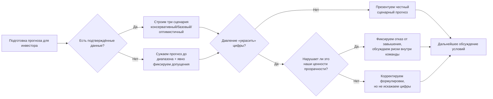

Настоящий отчёт посвящён осмыслению этических вопросов в развитии стартапа Birthsync (Бёрфсинк) и формированию устойчивого набора корпоративных ценностей и элементов культуры, которые будут направлять продуктовые, технические и управленческие решения команды. В фокусе — не абстрактная «этика в бизнесе», а практическое понимание того, как конкретные моральные выборы отражаются на доверии пользователей, отношениях с партнёрами и инвесторами, а также на внутреннем климате команды.

Birthsync (Бёрфсинк) развивается как сервис, снимающий стресс вокруг дней рождения: продукт помогает пользователям хранить важные даты, предпочтения близких, идеи подарков и заранее напоминать о событиях, в том числе в формате Telegram-бота и Mini-app. Такой контекст делает вопросы доверия, конфиденциальности и честной коммуникации критически важными: пользователи передают сервису личные данные о себе и своих близких, а партнёры и инвесторы ожидают прозрачности и предсказуемости в работе команды.
### (2). Исходные данные и контекст стартапа
#### (2.1). Краткое описание продукта и модели ценности

Согласно ранее подготовленным материалам, Birthsync (Бёрфсинк) позиционируется как сервис, который «забирает с людей весь стресс вокруг дней рождения», объединяя в одном месте даты, предпочтения и идеи подарков для друзей и близких. Пользователь сохраняет события, заполняет или отправляет анкеты, ведёт виш-листы, получает напоминания и подсказки, а в дальнейшем — рекомендации по подаркам и партнёрские предложения от магазинов и сервисов впечатлений.

Из плана публикации MVP следует, что первая версия продукта реализована как Telegram-бот с вниманием к простоте входа («никаких установок») и прозрачной коммуникации: в описании отдельно подчёркивается отсутствие спама и то, что за ботом стоит небольшая команда живых людей. Это уже задаёт этический вектор: доверие, честность и уважение к личному пространству пользователя становятся фундаментом позиционирования.
#### (2.2). Команда, юридическая структура и предыдущие решения

Ранее в правовых и организационных материалах сформирована структура ООО «Бёрфсинк» с четырьмя ключевыми участниками: тимлидом (операционный и продуктовый контроль), техлидом (архитектура и инфраструктура), специалистом по дизайну и маркетингу, а также специалистом по тестированию и аналитике. Распределение долей и ролей опирается на вклад в продукт и предполагает вестинг, что само по себе отражает ценность долгосрочного партнёрства и справедливого вознаграждения.

Юридические кейсы (аккредитация ИТ-организации, регистрация в реестре ПО, план защиты ИС) показывают, что команда системно выстраивает «белую» модель работы: прозрачные ОКВЭД, акцент на белой зарплате, аккуратное оформление прав на код и дизайн, соответствие требованиям Минцифры и регуляторов. Это важно для этики: уже на организационном уровне задаётся ориентация не на «быстрый выигрыш любой ценой», а на устойчивость и легальность.
#### (2.3). Предыдущие стратегические решения и их этическое измерение

В отчётах по технологическим трендам и партнёрствам команда:

* выбирает консервативные метрики для пилотных проектов, чтобы не завышать ожиданий партнёров;
* отдельно проговаривает взаимную выгоду в партнёрских моделях;
* акцентирует необходимость управления рисками (качество данных, неуместный контент ИИ, изменения регуляторики);

Таким образом, исходный контекст уже содержит значимый этический задел: честность в обещаниях, уважение к данным пользователей и готовность учитывать интересы внешних стейкхолдеров.
### (3). Задание №1. Этические дилеммы в контексте стартапа
#### (3.1). Выбранная дилемма: завышенные обещания инвестору

Для разбора выбрана ситуационная дилемма «завышенные обещания инвестору». Для молодого технологического стартапа это одна из наиболее типичных и чувствительных ситуаций: от объёма и качества привлечённых инвестиций зависит возможность глубокой разработки продукта, маркетинговые бюджеты и скорость выхода на рынок, однако соблазн «подкрутить» цифры по росту, удержанию или монетизации ведёт к серьёзным долгосрочным рискам.

**Сценарий.** Команда (Бёрфсинк) готовится к встрече с потенциальным инвестором. На руках есть:
* реалистичный прогноз роста активной пользовательской базы (MAU) и выручки по консервативному сценарию;
* предварительные оценки эффектов от внедрения GenAI-ассистента и AI-персонализации, основанные на внешней аналитике и внутренних гипотезах;
* пилотные метрики по партнёрским кампаниям (конверсии в переход к партнёру, средний чек, размер комиссии);

Инвестор прямо или косвенно подталкивает к более агрессивным цифрам: «Если покажете потенциальный рост в 10 раз за два года и маржу выше, чем у конкурентов, будет проще обосновать сделку партнёрам фонда». У команды возникает дилемма: оставить честный, но менее впечатляющий прогноз или «подкрутить» цифры, рассчитывая потом «догнать» показатели реальными результатами.
#### (3.2). Возможные линии поведения и их последствия

Для системного анализа разложим дилемму на три основных стратегии:

1. **Стратегия A: Честный сценарный прогноз.**
   Команда показывает инвестору три сценария (консервативный, базовый, оптимистичный), явно помечая допущения, источники данных и диапазоны неопределённости. Например, фиксирует базовый прогноз роста MAU на $+100\%$ в год, оптимистичный — $+200\%$, при этом подчёркивает, что оптимистичный сценарий возможен лишь при успешном пилоте GenAI и подтверждении партнёрских гипотез.
2. **Стратегия B: Замаскированное завышение.**
   Команда формально показывает «сценарный» прогноз, но в питче и акцентах сознательно выдвигает вперёд только оптимистичные цифры, подаёт их как почти гарантируемый результат, умалчивая о рисках и условиях.
3. **Стратегия C: Жёсткое завышение.**
   Команда сознательно завышает ожидаемые метрики (например, декларирует рост MAU $+300\%$ в год и долю платящих пользователей $>15\%$ без реальных оснований), рассчитывая, что к моменту проверки либо показатели вырастут, либо инвестор уже будет «слишком вовлечён».

С точки зрения этики и долгосрочной устойчивости стратегии B и C проблемны:

* **Стратегия B** создаёт асимметрию ожиданий: формально документы можно трактовать как «сценарии», фактически же инвестор воспринимает верхнюю границу как обещание.
* **Стратегия C** по сути является обманом, даже если он завуалирован сложными таблицами и «допущениями»: вероятность того, что фактические KPI окажутся существенно ниже декларируемых, высока, а репутационные потери в перспективе серии раундов и работы с рынком могут оказаться критическими.

Формально можно взглянуть на ожидаемую «цену» завышения через упрощённую модель ожидаемого ущерба:
$$
\mathbf{E}[\text{Ущерб}] = \mathbf{P}(\text{провал метрик}) \times \mathbf{C}_{репутация} +\mathbf{P}_{юр.\ конфликт} \times \mathbf{C}_{юр.\ конфликт}$$

  
где $C_{\text{репутация}}$ — долгосрочная стоимость потери доверия инвесторов и партнёров (невозможность последующих раундов, более жёсткие условия), а $C_{\text{юр.\ конфликт}}$ — прямые последствия (расторжение сделки, юридические риски). При завышении цифр $P(\text{провал метрик})$ существенно выше, чем при честном сценарном прогнозе, а $C_{\text{репутация}}$ для молодого стартапа практически максимален, так как бренд и команда ещё не успели накопить «подушку доверия».
#### (3.3). Позиция команды стартапа и опорные ценности

Опираясь на уже сформированные подходы в партнёрских документах (консервативные цифры пилота, честное описание выгод для обеих сторон), логично, что команда Birthsync выбирает стратегию A — честный сценарный прогноз с подчёркиванием неопределённостей.

Эта позиция опирается на следующие ценности:

* **Прозрачность и честность.**
  Команда избегает манипуляций ожиданиями, даже если это может уменьшить вероятность сделки в краткосрочной перспективе;
* **Ответственность перед стейкхолдерами.**
  Инвестиции рассматриваются как партнёрство, а не как «выигрыш» в переговорах;
* **Долгосрочный горизонт.**
  Проект уже выстраивает легальную и техническую инфраструктуру «вдолгую» (аккредитация, реестр ПО, защита ИС), что логично сочетается с честной финансовой и продуктовой коммуникацией;
#### (3.4). Визуализация процесса принятия решения по дилемме

Для закрепления подхода полезно зафиксировать схему, которая может использоваться как внутренняя шпаргалка при подготовке к любым переговорам с инвесторами или крупными партнёрами:

Такая схема вписывается в «шахматный» подход к стратегии: заранее продуманы альтернативы и условия переключения, а не только один «идеальный» путь.
### (4). Задание №2. Формулировка ключевых ценностей стартапа
#### (4.1). Логика выбора ценностей

Ценности стартапа не должны быть абстрактным набором красивых слов. Они работают только тогда, когда:

* связаны с реальной бизнес-моделью и продуктом;
* проявляются в ежедневных решениях (какого пользователя считать «успешно онборженным», какие данные собирать, что считать допустимыми маркетинговыми практиками);
* имеют измеримые проявления (KPI, принципы в документах, шаблоны коммуникаций);

Ниже сформулированы 5 ключевых ценностей Birthsync (Бёрфсинк) и способы их операционализации.
#### (4.2). Ценность 1: Доверие и прозрачность

**Формулировка.** Birthsync (Бёрфсинк) строится как сервис, которому можно доверить личные даты и предпочтения близких. Прозрачность означает честное объяснение того, какие данные собираются, как используются и какие ограничения есть у продукта.

**Практические проявления:**

* В описании бота и на лендинге прямо указано, что данные используются только для напоминаний, рекомендаций и улучшения сервиса, без продажи третьим лицам и спама;
* Внутренние документы и интерфейсы оформления юридических процедур (аккредитация, реестр ПО) строятся как «целостная история», где данные не противоречат друг другу;
  
**Метрики успеха:**

* доля пользователей, прочитавших и принявших прозрачную политику конфиденциальности (целевой уровень — не менее $80\%$ среди активных пользователей, так как политика должна быть короткой и понятной);
* количество жалоб на «непонятное использование данных» (стремится к $0$, допустимый уровень — не более $1\%$ обращений в поддержку);
#### (4.3). Ценность 2: Забота о пользователе и его близких

**Формулировка.** Birthsync (Бёрфсинк) — не просто календарь, а сервис, который помогает пользователю проявлять внимание к близким без лишнего стресса.

**Практические проявления:**

* Приоритизация фич, которые уменьшают когнитивную нагрузку: умные напоминания, внятный онбординг через Telegram, предложенные идеи подарков вместо голых дат;
* Уважение к предпочтениям и «точно нельзя» из анкет: в рекомендациях подчёркивается избегание нежелательных подарков;

**Метрики успеха:**

* регулярный NPS и CSAT опросы (целевое значение NPS $>30$, CSAT $>4,3$ из 5);
* доля пользователей, которые за 3 месяца сохранили хотя бы одну идею подарка и вернулись к ней (целевое значение — $>50\%$ активной базы);
#### (4.4). Ценность 3: Конфиденциальность и безопасность данных

**Формулировка.** Личные даты и предпочтения — чувствительная информация, поэтому безопасность и минимизация данных — не факультативный, а базовый принцип.

**Практические проявления:**

* архитектура хранения данных продумывается с учётом требований GDPR и российских стандартов защиты данных при выходе на международные рынки;
* минимизация собираемых полей в анкетах, возможность удалить данные, понятный формат согласия;

**Метрики успеха:**

* отсутствие инцидентов утечки данных (цель — $0$ критических инцидентов в год);
* среднее время реакции на запрос пользователя о удалении/выдаче данных (SLA, например $<7$ календарных дней);
#### (4.5). Ценность 4: Ответственность и выполнение обязательств

**Формулировка.** Если Birthsync (Бёрфсинк) пообещал напомнить о событии или предоставить определённый уровень сервиса, команда делает всё, чтобы это обещание выполнить.

**Практические проявления:**

* SLA по доставке напоминаний (например, не более $5$ минут задержки относительно запланированного времени, зафиксированный в технической документации);
* Консервативные обещания по результатам пилотов партнёрам и инвесторам, отказ от «космических» цифр без основания;

**Метрики успеха:**

* доля вовремя доставленных напоминаний ($>99\%$ в месяц);
* количество инцидентов, когда пользователи жалуются на «пропущенные» события (стремится к нулю, любая жалоба — триггер для постмортема);
#### (4.6). Ценность 5: Командное партнёрство и уважение к ролям

**Формулировка.** Стартап строится как партнёрство, а не как набор «звёзд». Каждый участник несёт ответственность за свой блок и имеет право голоса в стратегических вопросах.

**Практические проявления:**

* прозрачное распределение долей и ролей, подкреплённое вестингом и партнёрским соглашением;
* регулярные ретроспективы, где обсуждаются не только продуктовые результаты, но и качество взаимодействия внутри команды;

**Метрики успеха:**

* текучесть в core-команде (желательно $0$ в первые 2–3 года);
* субъективный индекс удовлетворённости командой (опрос раз в квартал, целевой средний балл $>4,2$ из 5);
### (5). Задание №3. Культурный код и манифест стартапа
#### (5.1). Принципы построения культурного кода

Культурный код — это набор ритуалов, форматов коммуникации и правил поведения, который помогает ценностям «прорастать» в ежедневных действиях. Если ценности отвечают на вопрос «во что мы верим», то культурный код отвечает на вопрос «что мы делаем, когда никто не смотрит».

Для нашего стартапа культурный код должен опираться на:

* постоянную работу с пользователями (интервью, обратная связь, аналитика);
* аккуратное отношение к данным и юридическим требованиям;
* командную дисциплину в обещаниях и сроках;
#### (5.2). Ключевые ритуалы и форматы работы

Ниже представлены основные ритуалы и форматы, которые поддерживают выбранную культуру. Таблица фиксирует их назначение, периодичность и ожидаемый эффект.

| Ритуал / формат                               | Периодичность               | Цель и ожидаемый эффект                                                                       |     |     |     |
| --------------------------------------------- | --------------------------- | --------------------------------------------------------------------------------------------- | --- | --- | --- |
| «Этический чек» новых фич                     | Перед каждой крупной фичой  | Проверка функции на соответствие ценностям (данные, прозрачность, влияние на пользователей).  |     |     |     |
| Еженедельный продуктовый «stand-up»           | 1 раз в неделю              | Синхронизация по задачам, рискам и пользовательской обратной связи.                           |     |     |     |
| Ретроспектива раз в спринт                    | 1 раз в 2–4 недели          | Анализ того, что сработало/не сработало, в том числе по части коммуникации и этики.           |     |     |     |
| Дайджест технологических и этических трендов  | 1 раз в 2 недели            | Обновление контекста по трендам ИИ, правовым изменениям и кейсам этики в индустрии.           |     |     |     ||

Интерпретируя таблицу, можно отметить, что ритуалы «этический чек» и регулярный дайджест трендов напрямую связывают ценности с процесcом разработки: любая новая функция (например, GenAI-ассистент поздравлений) проходит не только технический, но и этический ревью, а команда актуализирует знания о рисках и регуляторике.
#### (5.3). Документ «О нас» (краткий манифест)

В качестве рабочей версии культурного кода можно использовать морально-ориентипрованный текст, оформленный как страница «О нас» во внутренней базе знаний и, в сокращённой форме, на внешнем лендинге. Файл прикреплен отдельно.
### (6). Заключение и рекомендации

В отчёте показано, что для Birthsync (Бёрфсинк) этика и культура — не факультативное дополнение к продуктовой стратегии, а один из ключевых факторов долгосрочной устойчивости. Продукт работает с личными данными и эмоционально насыщенными событиями, поэтому доверие и конфиденциальность оказываются столь же важны, как функциональность и дизайн.

Разбор дилеммы с завышенными обещаниями инвестору демонстрирует, что команда сознательно выбирает путь честного сценарного прогноза, даже если это может замедлить привлечение средств. Такой подход согласуется с уже принятыми решениями по аккредитации, регистрации в реестре ПО и работе с партнёрами, где акцент делается на прозрачности, юридической чистоте и ответственном управлении рисками.

Сформулированные пять ценностей — доверие и прозрачность, забота о пользователе, конфиденциальность, ответственность за обязательства и командное партнёрство — образуют связную систему, которая:

* напрямую поддерживает продуктовую модель Birthsync  (Бёрфсинк);
* может быть переведена в конкретные метрики и процессы;
* помогает избегать как очевидных, так и «серых» этических зон;

Предложенный культурный код и чек-лист внедрения задают практическую траекторию на несколько месяцев вперёд: от фиксации манифеста и интеграции «этического чека» в процесс разработки до настройки мониторинга и квартального пересмотра ценностей. Важно, чтобы команда относилась к этим элементам не как к «отчётности для курса», а как к живому инструменту — иначе высок риск «бумажной этики».

Рекомендуется:

1. Завершить формализацию ценностей и манифеста в течение ближайших 1–2 недель и сразу встроить их в процессы (issue templates, ретроспективы, on-boarding);
2. Уже на этапе разработки GenAI-сценариев и расширения партнёрств использовать «этический чек» как обязательный шаг ревью;
3. Вести учёт и анализ этических инцидентов (жалобы на контент, уведомления, непонимание использования данных) наравне с обычными багами и метриками продукта;
4. Подготовить краткое внешнее изложение ценностей и культурного кода для лендинга и коммуникации с инвесторами — но при этом сохранить более глубокую внутреннюю версию, которая останется честной и не «отполированной до глянца»;

Если Birthsync (Бёрфсинк) сможет последовательно придерживаться выбранной этической рамки, это станет одним из ключевых конкурентных преимуществ: на рынке, где многие сервисы выстраивают рост на грани манипуляции и злоупотребления данными, честный и заботливый продукт заметно выделяется и лучше удерживает пользователей в долгую.